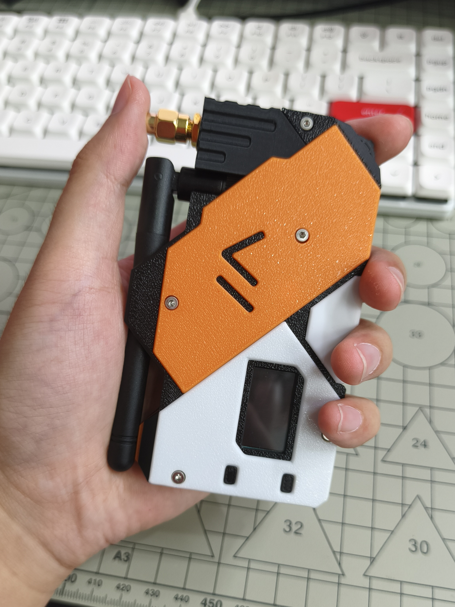
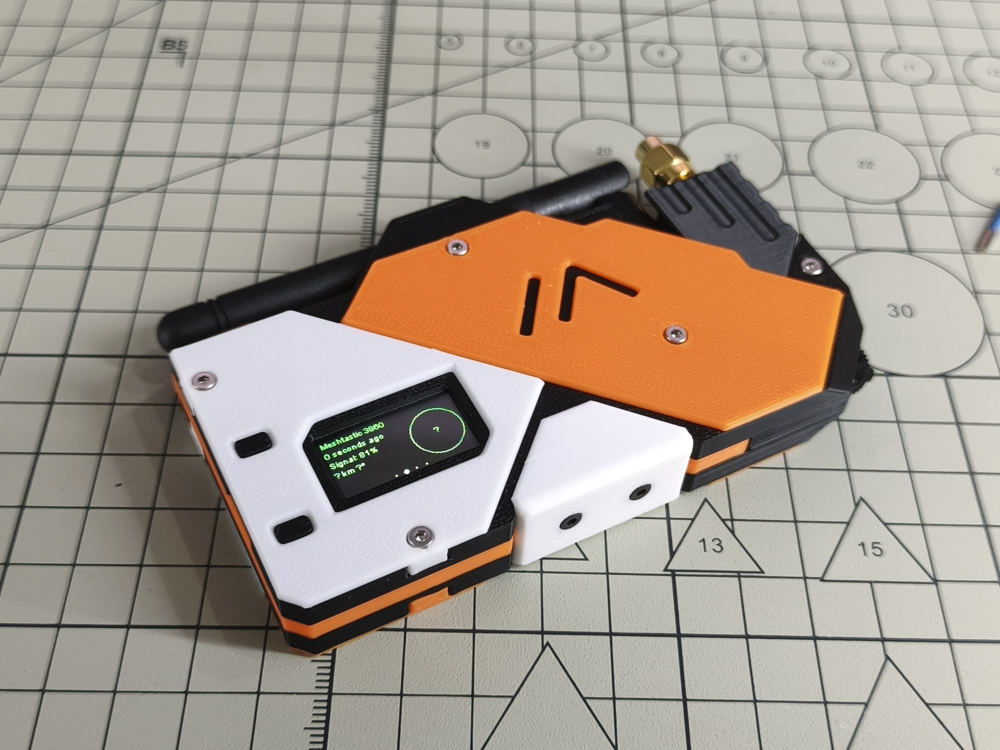
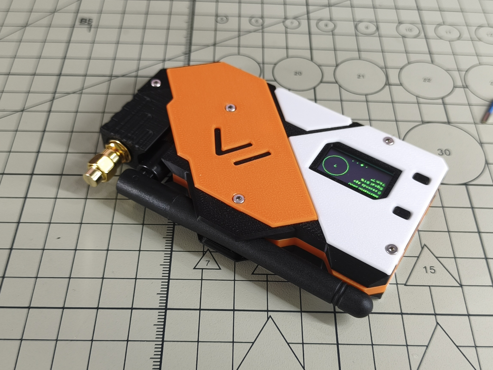
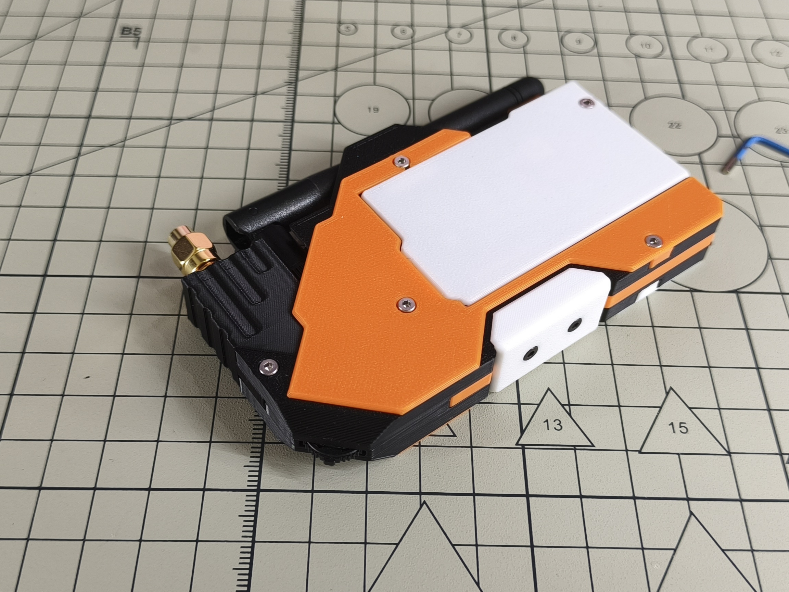
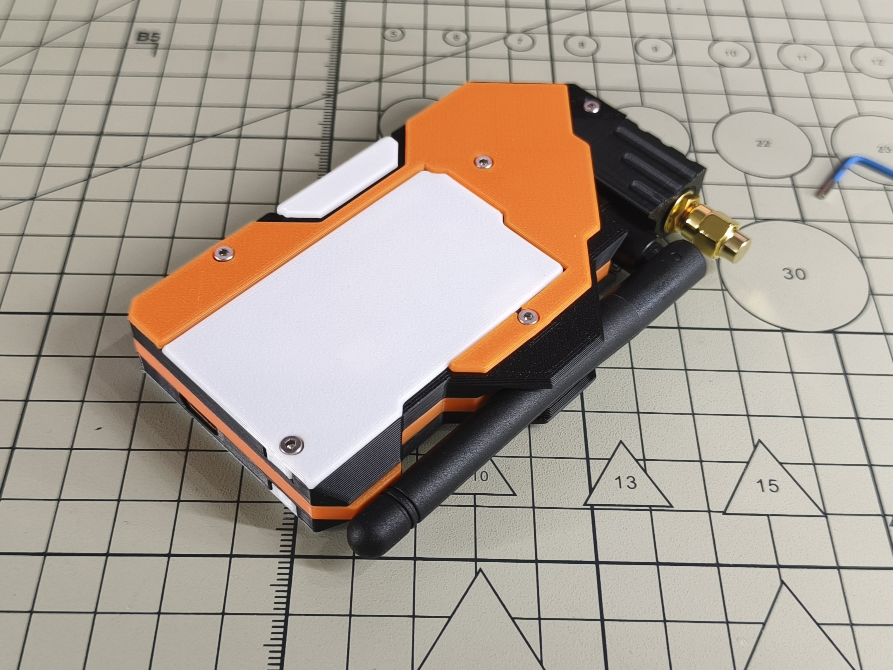
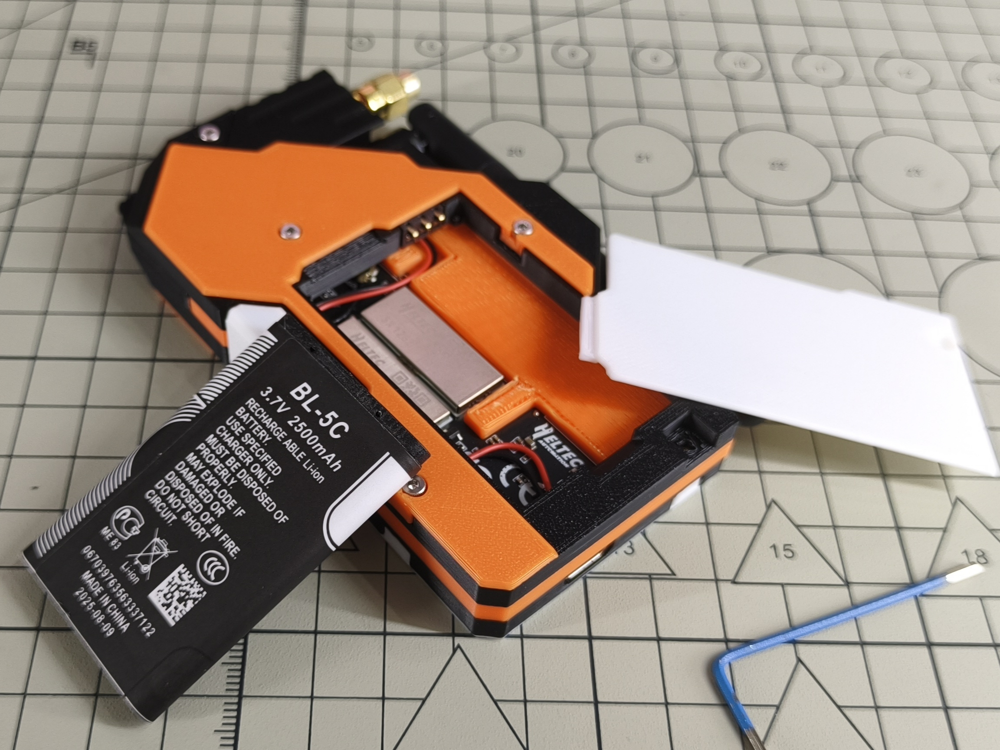

# MeshT1 - Enclosure for Heltec Tracker

This print kit is designed for the Heltec Tracker.

## Features

- Foldable design for integrated LoRa antenna storage
- Reserved GNSS SMA interface
- Supports sending preset messages using a rotary switch
- Removable back cover for battery replacement

## BOM List

1. 3D Printed Enclosure C1
2. 3D Printed Enclosure C2
3. 3D Printed Enclosure C3
4. 3D Printed Enclosure C4
5. 3D Printed Enclosure M1
6. 3D Printed Enclosure U1
7. 3D Printed Enclosure L1
8. 3D Printed Enclosure S1
9. 3D Printed Enclosure S2
10. 3D Printed Enclosure B1
11. Heltec Tracker
12. BL-5C Battery
13. Hex Socket Head Cap Screw M2x5 (4 pcs)
14. Hex Socket Flat Head Screw M2x4 (2 pcs)
15. Hex Socket Head Cap Screw M2x6 (8 pcs)
16. SMA Dust Cap
17. JK-11 LoRa Stick Antenna
18. TM-2024A Rotary Switch
19. BC-29-3P 3mm Pitch Spring Contact Battery Holder
20. IPEX to SMA Female Adapter Cable, 5cm length (2 pcs)
21. M2x4 Double-pass Knurled Nut, 3mm outer diameter (6 pcs)

## Assembly Instructions

Solder the pins of the rotary switch to the Tracker as shown in the diagram. From left to right, the pins are: 26, 48, GND, 21. Use adhesive to attach the rotary switch to printed enclosure U1. The two plastic posts on the rotary switch need to be shaved off.

Install the printed enclosure B1 button into the two holes at the bottom. Organize the wires and install the Tracker onto U1. Embed the M2x4 knurled nuts into printed enclosures M1 and S1. Install the two SMA adapter cables into printed enclosure S1 as shown below.

}K6.jpg)

Use two M2x5 hex socket head cap screws to install printed enclosure S1 onto printed enclosure U1. Connect the SMA adapter cables to the Tracker, with the upper cable connecting to the GNSS IPEX and the lower cable connecting to the LoRa IPEX.

Use four M2x6 hex socket head cap screws to install printed enclosures C1 and C2 onto printed enclosure U1.

Solder the battery cable included with the Tracker to the spring contact battery holder. Reserve about 10cm of battery cable length. Shave off the two plastic posts on the spring contact battery holder, then use adhesive to attach it to printed enclosure L1.

Insert the battery cable connector into the Tracker, and use two M2x5 hex socket head cap screws to install printed enclosure L1 onto printed enclosure M1.

Use two M2x4 hex socket flat head screws to install printed enclosure S2 onto printed enclosure M1.

Use three M2x6 hex socket head cap screws to install printed enclosure C3 onto printed enclosure L1. Install the SMA dust cap and JK-11 stick antenna onto the SMA interfaces.

Install the BL-5C battery into the battery compartment.

Use one M2x6 hex socket head cap screw to install printed enclosure C4 onto printed enclosure L1.

Assembly Complete.